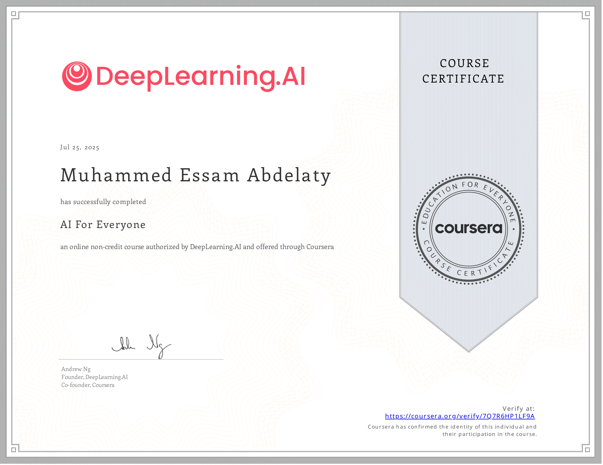

# AI For Everyone

Welcome to the **Coursera-AI-For-Everyone** repository! This repo is organized to help you easily navigate lectures, code, notes, quizzes, and mini-projects. Designed for both self-study and team collaboration.

---

---

## Repository Structure

Each folder corresponds to a specific lesson or module.  
Inside each lesson folder, you'll typically find:

- `lecture.pdf` → Lecture slides or PDFs.
- `notes.md` → Personal notes or transcript summaries.
- `code.ipynb` → Code used or explained in the lecture.

There are also:

- `/Assets/` → Visuals used in lectures or summaries.
- `/Quizzes/` → Questions & answers after each section.
- `/Projects/` → Projects done during the course.
- `/Resources/` → External reading, books, helpful links.

---

## Table of Contents

| Module | Description | Link |
|--------|-------------|------|
| 1 | Week 1 | [9 lessons](01-lessons/week-1/) |
| 2 | Week 2 | [8 lessons](01-lessons/week-2/) |
| 3 | Week 3 | [10 lessons](01-lessons/week-3/) |
| 4 | Week 4 | [8 lessons](01-lessons/week-4/) |

---

## How to Use

1. Clone the repo.
2. Start with the `01-lesson-name` folder.
3. Read the notes → Watch lecture → Run code → Solve quiz.
4. Repeat for each lesson.

---

## Notes

- This template is reusable for all future courses.
- Naming format for folders: `nn-lesson-name`.
- Always keep `notes.md` if exist up to date with your own understanding.
- You can add `.py`, `.ipynb`, `.md`, `.pdf` files depending on the course format.

---

###### “The best way to learn is to teach.” – Richard Feynman
